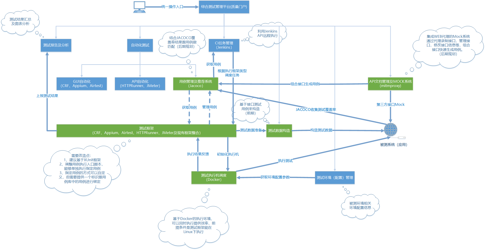

# 综合测试管理平台开源版

## 基于Docker启动服务

1. 构建前端

请先自行安装docker和node服务

```
cd OpenStarkWEB && npm install && npm run build
```

2. 启动服务

```
docker-compose up   # 会先自动构建docker镜像
```

3. 访问地址

测试平台：http://localhost:8090 

> 第一个注册的账户为管理员账户

Jenkins：http://localhost:8091

> 需自行配置，默认管理员密码会打印在控制台上，请留意

## 平台预览


## 平台整体架构图(还未完全实现)



## 一点说明

如果需要按照架构图整体跑起来，需要结合实际情况配置一些服务，包括配置Jenkins的测试执行项目，docker管理项目，jacoco监控项目等，这里仅供给大家参考和提供一些思路。
